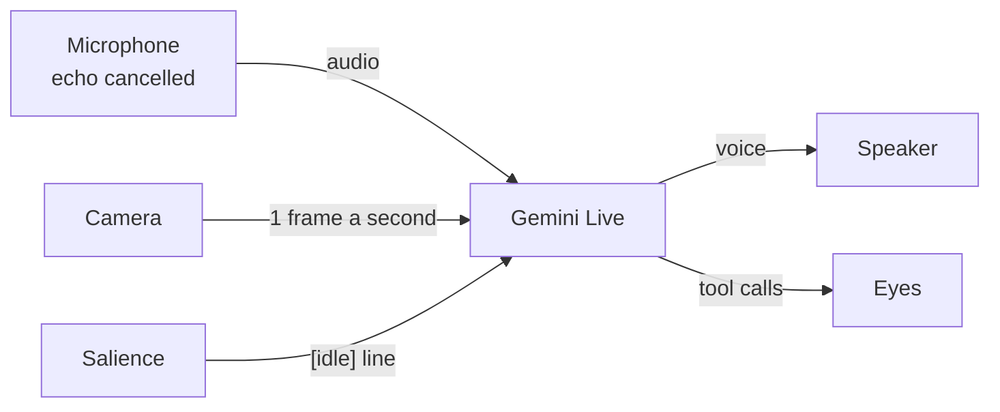
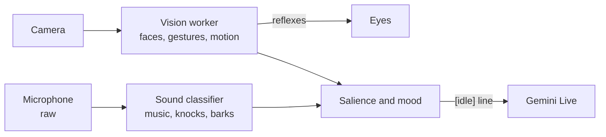
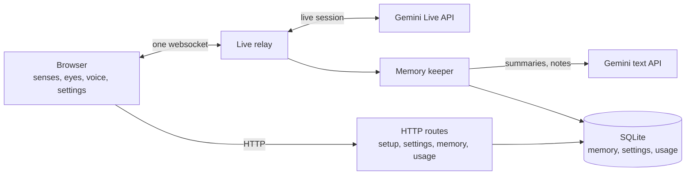

# Architecture

m8 is a character that lives in a browser tab as a pair of eyes. He sees through
the webcam, hears through the microphone, talks through a realtime speech model,
decides where to look, and keeps a memory that he summarizes himself.

m8 is a learning project. Clarity, observability and replaceable parts matter
more than polish.

## 1. Principles

1. **Two loops.** The fast loop runs many times a second in the browser, with no
   model. It handles perception, reflexes and the animation of the eyes. The slow
   loop runs over the network. It handles conversation and deliberate decisions.
   The eyes never wait for a model.
2. **The speech model owns the conversation and perceives for itself.** It
   receives the microphone and about one camera frame a second. Text enters the
   live session for five things only: a scripted line, an `[idle]` line, an
   `[away]` line, a `[who]` note and a `[so far]` note.
3. **Salience decides when he is bored.** A leaky integrate-and-fire filter
   weighs every local event. When it fires and nobody has had the floor for a
   while, he starts something. Otherwise the fire is dropped.
4. **The core is frozen and the self changes.** The core persona is a file in
   git that no model edits. It has four slots that setup fills: the language,
   the accent, how he says his name in that language, and the name of the
   person. The self-model lives in SQLite and is
   rewritten by summarization.
5. **Contracts first.** Every boundary is a Zod schema in `packages/shared`.
   Modules meet only through those contracts.
6. **Jobs, never model names.** Code names a job, `live` or `memory`. The model
   for each job is a setting, chosen from the list Gemini returns for the key
   (section 7.5).
7. **The browser speaks our protocol.** Server-side adapters translate it for a
   provider.

## 2. Conceptual model

Two loops run side by side. The slow loop is the conversation: the live model
gets the microphone and the camera, and answers with a voice and tool calls.



The fast loop runs in the browser with no model. It moves the eyes many times a
second and decides when he is bored enough to speak first. His own voice moves
the eyes too, through `voice.level` (section 5.1).



The model perceives for itself. The local senses drive the reflexes, and decide
when he speaks without being spoken to.

| Outcome of a fire | When                                                                                 | Effect                                   |
| ----------------- | ------------------------------------------------------------------------------------ | ---------------------------------------- |
| Dropped           | Somebody has the floor, or had it seconds ago, or the fire was small.                | Nothing. Nothing is kept for later.      |
| Said              | The fire is well over the threshold, the floor is free, and no idle line was recent. | One `[idle]` line goes into the session. |

The persona tells the model what each kind of line is. None of them is a person
speaking.

| Line       | Sent by | Meaning                                                                    |
| ---------- | ------- | -------------------------------------------------------------------------- |
| `[idle]`   | Browser | He is bored. He starts something.                                          |
| `[away]`   | Browser | The person has left the frame. He asks where they went.                    |
| `[so far]` | Server  | A note to himself about a long conversation. He never reads it out.        |
| `[script]` | Browser | A sentence to say exactly, such as the first greeting.                     |
| `[who]`    | Browser | Who is in front of him, by name when he knows the face, when that changes. |

## 3. Deployment view



- The browser opens one websocket to Hono, and Hono opens the upstream session.
  The Gemini key stays on the server.
- Hono calls Gemini directly: the live session over the Live API websocket, and
  the memory model over `generateContent`. No proxy sits between them.
- You can set `M8_ACCESS_KEY` to protect the live relay and the memory routes. A
  browser gives the key once and receives an HttpOnly cookie. Set the key before
  you put the server behind a tunnel. Without a key the server is open, which
  suits localhost.
- In production Hono serves the web build, cached and compressed, from one port:
  `bun run start`, with `--host` and `--port`. In development Vite serves the
  browser and proxies to Hono.

## 4. Repository layout

```
apps/
  web/                      Vite + React
    scripts/                vendor-workers.ts: builds the two sense workers outside Vite
    public/                 vision/ and hearing/: the built workers and their models
    src/
      senses/
        audio/              processed mic to PCM, raw mic to the ambient worker, self-voice gating
        vision/             camera, vision.worker (MediaPipe, the face embedder), tracks, derive.ts (events from findings), motion
      bus/                  typed event bus, recorder and player
      fusion/               salience wired to the bus: weights, the idle decision, impatience
      mood/                 mood variables, decay toward baseline
      brain/                websocket client, tool dispatch, the floor, the microphone gate, who is in view, camera frames, the event log, voice levels
      eyes/                 rig, springs, brainstem, gaze arbiter, emotions, gestures, flourishes
      voice/                streamed playback, barge-in, the robot effect, foley
      debug/                the rig: face, mind, senses, memory and log tabs, in the DevTools style
      setup/                first-run screen: language and name, stored in the browser
      gemini/               the key step before setup, and the Gemini section of the settings
      access/               the key screen, shown first when the server wants a key
      settings/             the settings sheet in five tabs, and the switches it and the rig share
      usage/                the Usage tab: the report, the day grouping, the cost chart
      sheet/                the panel beside the stage, a bottom sheet on a phone, and the rig's dock and size
      memory/               reads the memory routes, for the settings and the rig, and the faces he knows
  server/                   Hono on Bun
    src/
      cli.ts                --host and --port, and the network addresses printed at start
      routes/               live.ts (ws relay), memory.ts, gemini.ts, usage.ts, access.ts, health.ts, ping-model.ts, static-site.ts
      brain/                RealtimeBrain interface, the gemini-live adapter
      gemini/               the account (key, models, daily limit), the model listing, the text client
      secrets/              the secret box that seals the Gemini key, and its root key file
      settings/             one JSON value per key in the settings table
      usage/                the usage ledger: one row per call and per live turn, priced when written
      memory/               SQLite: migrations, sessions, facts, episodes, faces, keeper, bootstrap, summarizer
      tools/                server-side executors: remember, recall
packages/
  shared/                   Zod schemas: events, tools, ws protocol, memory, access, settings, setup, recording, gemini, usage, prices
  salience/                 pure TS leaky integrate-and-fire + habituation (bun test)
  persona/                  persona.md (frozen core, with slots for language, accent, spoken name and name) + loader
keys/                       secret.key, generated on first start, ignored by git
docs/
  architecture.md, what-it-notices.md, third-party.md, code-style.md, documentation-guidelines.md
  CONTRIBUTING.md, SECURITY.md, CODE_OF_CONDUCT.md, logo.svg
```

## 5. Senses

### 5.1 Audio: two tracks from one microphone

| Track     | Constraints                                                  | Consumer                              |
| --------- | ------------------------------------------------------------ | ------------------------------------- |
| Processed | `echoCancellation`, `noiseSuppression`, `autoGainControl` on | Streamed as PCM to the realtime model |
| Raw       | All three off                                                | The sound classifier                  |

- The processing removes music and room sound, so the classifier needs the raw
  track.
- The two tracks come from two `getUserMedia` calls. A cloned track keeps the
  processing of its source.
- The raw track contains his own voice. Hearing discards every window that
  overlaps his speech, plus 700 ms after.
- The classifier is the MediaPipe Audio Classifier (YAMNet, about 500 AudioSet
  classes), in a worker, on windows of about one second. It emits `sound.class`
  and `sound.loud`.
- The processed track and his own voice are measured about fifteen times a
  second for loudness and brightness. The result is the `voice.level` event,
  which moves the eyes.
- A browser keeps an audio context suspended until somebody touches the page.
  `use-audio-unlocked.ts` detects that. Until the first touch, the microphones,
  the voice and the session do not start, and one line under the eyes asks for
  the touch.
- Both sense workers are classic workers built outside Vite. They do not hot
  reload. Run `bun run vendor` to rebuild them.
- Sound direction is out of scope.

### 5.2 Vision: local detectors and the live feed

| Part             | What                                                                                                                      | Rate                                                | Where                                                | Output                                 |
| ---------------- | ------------------------------------------------------------------------------------------------------------------------- | --------------------------------------------------- | ---------------------------------------------------- | -------------------------------------- |
| 1. Detectors     | MediaPipe Face Landmarker (478 landmarks, 52 blendshapes, up to three faces), gesture recognizer, frame-difference motion | 12 fps                                              | Web worker                                           | Structured events on the bus           |
| 1b. Recogniser   | A MobileFaceNet with an ArcFace head, on ONNX Runtime Web, over a face aligned from the landmarks                         | One face every two seconds, while the setting is on | The same worker                                      | `vision.person` on the bus             |
| 2. The live feed | Camera frames, 320 pixels on the long side, JPEG at quality 0.5                                                           | One a second at most, while a session is live       | Browser to Hono as `vision.frame`, then the provider | Realtime video input to the live model |

- The detectors derive: face present, position, facing, smile, surprise, frown,
  talking, wave, thumbs up, point, open palm, motion, presence, and the stages of
  being left alone. Each face carries a track id that survives from frame to
  frame.
- The recogniser is off until the person switches it on in the settings. On, it
  embeds each face and matches the embedding against the faces in his memory.
  A match is a name; below the threshold it is a stranger. A face is learned
  when somebody tells him their name and the model calls `name_face`, or from
  the settings sheet.
- Embeddings never leave the machine the server runs on. The model is told
  names, through the bootstrap, a `[who]` note and the `who_is_here` tool.
- The detectors drive the gaze reflexes and gestures, and feed salience and
  mood. They never choose an emotion. Only `set_emotion` does.
- Landmarks, blendshapes and every other detector result stay in the browser.
- Camera frames leave the browser while a session is live. They go to the server
  and then to the provider. The setup screen says so.
- The presence gate closes the session when nobody is there, and no frames are
  sent without a session.
- "Where he looks" means the direction of the pupils. The live feed is always
  the full frame.

Two parts are designed and not built. They suit a brain that cannot take video.

| Part            | Design                                                                                            |
| --------------- | ------------------------------------------------------------------------------------------------- |
| Scene describer | A cheap text and vision model on keyframes. It reports what changed and publishes `vision.scene`. |
| Look closer     | A `look_closer` tool that answers a visual question from a crop around the gaze target.           |

The `vision.scene` event is in the contract for this design. Nothing publishes
it.

### 5.3 Event contract (excerpt)

```ts
// packages/shared/src/events.ts
type SenseEvent =
  | { type: "vision.face"; ts: number; id: string; x: number; y: number; size: number; facing: boolean }
  | { type: "vision.face.lost"; ts: number; id: string }
  | { type: "vision.person"; ts: number; id: string; name: string | null; score: number }
  | { type: "vision.expression"; ts: number; id: string; kind: "smile" | "surprise" | "frown" | "talking" }
  | { type: "vision.gesture"; ts: number; kind: "wave" | "thumbs_up" | "point" | "open_palm" }
  | { type: "vision.motion"; ts: number; x: number; y: number; magnitude: number }
  | { type: "vision.scene"; ts: number; delta: string }
  | { type: "sound.class"; ts: number; label: string; confidence: number }
  | { type: "sound.loud"; ts: number; db: number }
  | { type: "voice.level"; ts: number; who: "self" | "other"; level: number; brightness: number }
  | { type: "salience.fired"; ts: number; voltage: number; causes: string[]; outcome: "note" | "interrupt" }
  | { type: "presence"; ts: number; state: "present" | "absent" }
  | { type: "alone"; ts: number; stage: "looking" | "drowsy" | "dozing" | "asleep" }
  | { type: "mood"; ts: number; mood: { arousal: number; curiosity: number; boredom: number; valence: number } };
```

- Every coordinate is normalised from 0 to 1 and mirrored.
- On `salience.fired`, `interrupt` means an `[idle]` line was said, and `note`
  means the fire was dropped.

## 6. Salience, fusion and mood

`packages/salience` is pure TypeScript with no dependencies.

- Leaky integrate-and-fire: `V += dt/tau * (-V) + sum(weights[event.type] * gain)`.
  It fires at the threshold and resets.
- Habituation: each event key (type plus label) has a gain that drops on
  repetition and recovers over time.
- The threshold is an input. Mood supplies it.

Mood has four values from 0 to 1: `arousal`, `curiosity`, `boredom` and
`valence`. Each decays toward a baseline.

- Mood lives in the browser, because it changes salience in real time.
- Boredom rises in silence and lowers the threshold. Conversation raises the
  threshold.
- What he reacted to changes mood. What reached his senses does not.
- Fusion publishes mood on the bus as a `mood` event every fifteen seconds. The
  event log carries it to the server, and the session keeps the last one.

Fusion (`web/fusion`) runs ten times a second.

| Part       | Rule                                                                                                                                               |
| ---------- | -------------------------------------------------------------------------------------------------------------------------------------------------- |
| The floor  | `brain/floor.ts` tracks who is speaking. Text put into a session ends the speech in progress, so fusion sends nothing while anybody has the floor. |
| A fire     | It becomes an `[idle]` line when it is well over the threshold, the floor has been free for 6 seconds, and the last idle line was 20 seconds ago.  |
| Impatience | With somebody present and silent, he prompts after about 22 seconds, waits longer each time, and stops after three.                                |
| Missing    | When a face has just gone (`alone: looking`), he is sent one `[away]` line when the floor is free. It is not sent once he is drowsy.               |
| Company    | When who is in view changes and holds for 2 seconds, he is sent one `[who]` note when the floor is free. One stranger alone is not news.           |
| Hints      | An idle line carries a hint from a local sense when there is one, such as a classified sound.                                                      |
| The clock  | Every `[idle]` and `[away]` line ends with the time.                                                                                               |

Presence gates the live session.

| Time with nobody | What happens                                         |
| ---------------- | ---------------------------------------------------- |
| 4 s              | He looks around and asks where the person went.      |
| 18 s             | He yawns.                                            |
| 32 s             | He dozes.                                            |
| 46 s             | He is asleep.                                        |
| About 49 s       | The session closes. A face wakes him and reconnects. |

- A tab hidden for fifteen seconds closes the camera, the microphones and the
  session. Showing the tab reopens them.
- Every call and every live turn is metered (section 7.6). A hard limit on how
  long sessions stay open is not built yet.

## 7. The brain

### 7.1 Interface

```ts
// apps/server/src/brain/types.ts
interface RealtimeBrain {
  connect(bootstrap: BootstrapPacket): Promise<void>;
  sendAudio(pcm: ArrayBuffer): void;            // PCM16 at 16 kHz
  sendFrame(jpeg: string): void;                // realtime input, never interrupts
  sendActivity(state: "start" | "end"): void;   // the person's turn, when the browser marks it
  sendNote(text: string): void;                 // text, no reply asked for
  sendInterrupt(text: string): void;            // text, and a reply asked for
  sendToolResult(callId: string, result: unknown): void;
  on(listener: (event: BrainEvent) => void): void;
  close(): void;
}

type BrainEvent =
  | { type: "audio"; pcm: ArrayBuffer }         // PCM16 at 24 kHz
  | { type: "tool_call"; callId: string; input: ToolInput }
  | { type: "server_tool_call"; callId: string; name: string; args: Record<string, unknown> }
  | { type: "transcript"; role: "user" | "model"; text: string }
  | { type: "interrupted" }
  | { type: "usage"; counts: TokenCounts }      // once per turn, for the ledger
  | { type: "closed"; reason: string };
```

- The adapter builds its tool declarations from the registry in
  `packages/shared`. `connect` takes only the bootstrap packet: the persona, and
  the memory as text (section 9).
- A tool that the server carries out arrives as a `server_tool_call` event with
  unvalidated arguments. The relay validates it and carries it out.
- One adapter exists: `gemini-live`. It opens the Gemini Live socket itself.
- The session opens with sliding-window context compression, at the size the
  context setting chooses (section 7.5). Without it a session that carries
  video ends after two minutes.
- Who marks the turns is decided at connect time. With `everyone`, the model's
  own voice activity detector marks them, and anybody who speaks over him
  interrupts him. With `button`, the detector is off and `sendActivity` marks
  the turns from the talk button. Section 7.4 has the reason.
- You can add another adapter, such as a local speech-to-speech model, without
  changing the browser.

### 7.2 Browser to server websocket protocol

The protocol is defined in `packages/shared/src/protocol.ts`.

- Binary frames carry PCM16 audio: 16 kHz up and 24 kHz down.
- JSON frames carry everything else.
- The connect carries the voice, the language, the name and who marks the
  turns in its query string. The server validates all four.

| Direction | Message                            | Purpose                                                            |
| --------- | ---------------------------------- | ------------------------------------------------------------------ |
| up        | binary                             | Processed microphone PCM16                                         |
| up        | `senses.note` / `senses.interrupt` | Text into the session: an `[idle]`, `[away]` or `[script]` line    |
| up        | `senses.activity`                  | The person's turn starts or ends, when the browser marks the turns |
| up        | `vision.frame`                     | One camera frame as base64 JPEG, at most one a second              |
| up        | `tool.result`                      | The result of a client-executed tool                               |
| up        | `events.batch`                     | Slow sense events and mood, every five seconds                     |
| down      | binary                             | The model's speech                                                 |
| down      | `tool.call`                        | A client-executed tool to carry out                                |
| down      | `tool.ran`                         | A tool the server carried out, for the session inspector           |
| down      | `transcript`                       | Input and output transcripts                                       |
| down      | `speech.interrupted`               | Barge-in: stop playback now                                        |
| down      | `session.state`                    | connecting, live, sleeping, reconnecting, failed                   |

The transcripts and the tool calls pass through the server, so the memory stores
them without a message of their own.

### 7.3 Tools: one registry, two executors

```ts
// packages/shared/src/tools.ts
export const GazeTarget = z.enum([
  "speaker", "nearest_face", "motion", "away", "up_thinking", "down", "around",
]);
export const Emotion = z.enum([
  "neutral", "happy", "curious", "skeptical", "sleepy", "sad", "annoyed",
  "shy", "excited", "focused", "thinking", "stressed", "shocked",
]);
export const GestureKind = z.enum([
  "double_take", "eye_roll", "squint", "wide_eyes", "slow_blink", "nod", "shake", "yawn",
]);

export const tools = {
  look_at: {
    executor: "client",
    input: z.object({
      target: GazeTarget,
      hold_ms: z.number().int().min(200).max(10_000).default(2000),
    }),
  },
  set_emotion: {
    executor: "client",
    input: z.object({ emotion: Emotion }),
  },
  gesture: {
    executor: "client",
    input: z.object({ kind: GestureKind }),
  },
  who_is_here: {                    // answered from the bus: names, places, who is talking
    executor: "client",
    input: z.object({}),
  },
  name_face: {                      // learns the face in front of him under a name
    executor: "client",
    input: z.object({ name_of_person: z.string().min(1).max(60) }),
  },
  remember: {
    executor: "server",
    input: z.object({
      text: z.string().min(1).max(280),
      kind: FactKind,                 // person, preference, event, self
      importance: z.number().int().min(1).max(5),
    }),
  },
  recall: {
    executor: "server",
    input: z.object({ query: z.string().min(1).max(120) }),
  },
} as const;
```

- Each entry also carries the description that the model reads. The descriptions
  are tuned prompts and live only in the code.
- The server generates the provider's tool declarations from this registry when
  a session opens.
- A `client` tool is forwarded to the browser and answered at once. The model
  produces no audio until a tool result arrives. A tool that answers with words
  sends them back in the result's `answer`.
- A `server` tool runs in `apps/server/src/tools`, and the relay answers it from
  SQLite. The browser is told afterwards with `tool.ran`.
- A tool is declared only when something can answer it.
- Gaze targets are names. The gaze arbiter resolves them to coordinates on every
  frame.

### 7.4 Who marks the turns

The model's own voice activity detector is tuned for one person on one
microphone. In a room where other people talk, every voice takes a turn and
every voice interrupts him, and he cannot tell the voices apart. So who marks
the turns is a setting, `listensTo`, and the browser can take the job.

| Setting    | Who marks the turns                                                                                                                                |
| ---------- | -------------------------------------------------------------------------------------------------------------------------------------------------- |
| `everyone` | The model. Anybody who speaks takes a turn, and anybody who speaks over him interrupts him. Right for one person.                                  |
| `button`   | The person, by holding the talk button or the space bar. The microphone sends silence outside the hold, and the hold is sent as `senses.activity`. |

- The setting is part of the session's setup, so changing it reopens the session.
- With the button, the echo warm-up in `brain/mic-gate.ts` is not applied. The
  button is the whole gate, and the model's detector is off, so it cannot hear
  itself and interrupt itself.
- A press while he is speaking interrupts him, the same as a voice does with
  `everyone`.
- A press and a release both count as hearing the person for the floor.

### 7.5 The Gemini account

The server holds one Gemini key and two model choices, in the `settings` table.

| Part        | What it does                                                                                                                                         |
| ----------- | ---------------------------------------------------------------------------------------------------------------------------------------------------- |
| Key         | Checked with `GET /v1beta/models` before it is stored. Sealed with AES-256-GCM, bound to its row. The browser sees its last four characters.         |
| Root key    | `keys/secret.key`, 32 random bytes, mode 0600, generated on first start. The server refuses a keys directory inside the database's directory.        |
| Models      | Listed from Gemini. Live models support `bidiGenerateContent`, text models `generateContent`. A new key picks the newest of each.                    |
| Daily limit | `callsPerDay`, 0 by default, which means no limit. Each text request and each live session opened counts as one call in any 24 hours.                |
| Context     | `short`, `medium` or `long`: the live context slides at 10k, 20k or 40k tokens, down to 6k, 12k or 24k. Every turn is charged for its whole context. |

- `account.forCall(job)` reads the key and the model on every call, so a change
  applies to the next call without a restart.
- The browser asks for the key after the access key and before the language,
  only when the server has none. The same card then shows the two models, the
  newest of each chosen. A second browser skips the step.
- The Gemini tab of the settings has the masked key with Replace, the two
  models, the context size and the daily limit. The masked key, the live model
  and the context size are part of what the session opens with, so changing
  any of them reopens it.
- The routes are `GET` and `PATCH /api/gemini`, `PUT /api/gemini/key` and
  `GET /api/gemini/models`. `M8_ACCESS_KEY` guards them like the memory routes.

### 7.6 Usage records

The `usage` table holds one row per call and one row per live turn.

| Row    | Written when                                                | Tokens                                                     |
| ------ | ----------------------------------------------------------- | ---------------------------------------------------------- |
| `call` | `forCall` hands out a key: each text request, each session. | A text request's, once Gemini answers. None for a session. |
| `turn` | The live session reports `usageMetadata`, once per turn.    | The turn's. Its input is the whole context the turn read.  |

- Tokens are stored by modality: fresh and cached input as text, audio and
  image (video counts as image), output as text and audio, and thinking.
- A row is priced when it is written, in micro-dollars, from the table in
  `packages/shared/src/prices.ts`. A later price change does not rewrite it. A
  model with no price stores NULL.
- `saved_micros` is what the cache saved against the same tokens fresh.
- The daily limit counts `call` rows in the last 24 hours, so a restart does not
  clear it. A call Gemini refused still counts.
- The table has no foreign key to `sessions`. Forgetting the memory keeps the
  record of what was spent.
- A live session's call row gets `ended_at` when the session ends. On start
  the server closes any a crash left open, at their last turn.
- `GET /api/usage?from=<ms>` sums the table by hour, purpose and model, at most
  92 days back. The browser groups the hours into days in its own time zone.
  `M8_ACCESS_KEY` guards it.
- The Usage tab of the settings shows today, 7 or 30 days: four tiles (estimated cost and what caching saved, tokens, the share served from
  the cache, live time), cost per day as stacked SVG bars for conversation and
  memory, and a table by purpose and model.
- The Live API reports usage per turn, on the frame that completes it. A camera
  frame costs 256 tokens of image input per turn: only the latest frame is in
  the context, so skipping frames and `mediaResolution` save nothing.
- Every live turn re-reads its whole context. The context size setting caps
  it, and the `[so far]` note, written every five minutes of a long
  conversation, carries what slides out.

## 8. Eyes

| Part            | What it does                                                                                                                                                                                                                                                                                    |
| --------------- | ----------------------------------------------------------------------------------------------------------------------------------------------------------------------------------------------------------------------------------------------------------------------------------------------- |
| Rig             | SVG with these parameters: `gazeX`, `gazeY`, and per eye `upperLid`, `lowerLid`, `pupilSize`, `browTilt`, `squash` and `smile`. A spring drives each one. One animation frame loop drives everything.                                                                                           |
| Brainstem       | Blinks, micro-saccades, lids that follow the gaze, pupil response to arousal, idle wander. No model drives it. Its randomness comes from `createSeededRandom`, and a recording stores the seed.                                                                                                 |
| Emotion presets | Each `Emotion` maps to a set of parameter targets, scaled by intensity. `set_emotion` always sets full intensity, the same face as the rig's buttons. An expression holds for six seconds, then the face springs back to neutral as fast as it arrived. `sleepy` never fades: presence ends it. |
| Gaze arbiter    | Priority: a reflex glance, then the model's `look_at` until `hold_ms` expires, then the idle wander.                                                                                                                                                                                            |
| Reflexes        | They move the gaze and play gestures. They set `sleepy` by stages when nobody is there: a look around, a yawn, a slow blink, asleep.                                                                                                                                                            |
| Voice motion    | `voice.level` events stretch the eyes while he talks and widen them while he listens.                                                                                                                                                                                                           |
| Flourishes      | Decoration per emotion: tints, marks inside the eye, props outside it. They read the emotion and never write to the rig.                                                                                                                                                                        |
| Foley           | Synthesised robot sounds driven by the pose. They live in `web/voice`, because the eyes perform no I/O.                                                                                                                                                                                         |

- Nothing in `web/eyes` imports the brain, the senses, the voice, fusion, mood or
  debug. The eyes read the bus and nothing else.
- The smile bow fades as the eye closes, so a happy eye blinks to a flat line.
- The face stays readable with every flourish switched off.

## 9. Memory

The memory is one `bun:sqlite` file at `MEMORY_DB_PATH`. The default is
`data/m8.sqlite`, which git ignores. The schema is an ordered list of steps in
`apps/server/src/memory/migrations.ts`, counted in `PRAGMA user_version`. A step
is never edited after it ships.

```sql
CREATE TABLE sessions (
  id INTEGER PRIMARY KEY, started_at INTEGER, ended_at INTEGER, end_reason TEXT,
  person TEXT, language TEXT, mood TEXT
);
CREATE TABLE events (            -- raw log: turns, server tool calls, slow sense events
  id INTEGER PRIMARY KEY, session_id INTEGER, ts INTEGER, type TEXT, payload TEXT
);
CREATE TABLE episodes (          -- one summary per session worth one
  id INTEGER PRIMARY KEY, session_id INTEGER, summary TEXT, created_at INTEGER
);
CREATE TABLE facts (             -- durable memories
  id INTEGER PRIMARY KEY, kind TEXT, text TEXT, importance INTEGER, source TEXT,
  created_at INTEGER, last_used_at INTEGER, use_count INTEGER DEFAULT 0,
  superseded_by INTEGER
);
CREATE VIRTUAL TABLE facts_fts USING fts5(
  text, content='facts', content_rowid='id', tokenize='unicode61 remove_diacritics 2'
);
CREATE TABLE self_model (        -- the evolving self, one row per version
  version INTEGER PRIMARY KEY AUTOINCREMENT, body TEXT, created_at INTEGER, from_episode INTEGER
);
CREATE TABLE faces (             -- one embedding per row, up to five per name
  id INTEGER PRIMARY KEY, name TEXT, embedding BLOB, created_at INTEGER
);
CREATE TABLE settings (          -- one JSON value per key: the sealed Gemini key, the choice
  key TEXT PRIMARY KEY, value TEXT, updated_at INTEGER
);
CREATE TABLE usage (             -- one row per call and per live turn, section 7.6
  id INTEGER PRIMARY KEY, at INTEGER, kind TEXT, purpose TEXT, model TEXT, session_id INTEGER,
  input_text INTEGER, input_audio INTEGER, input_image INTEGER,
  cached_text INTEGER, cached_audio INTEGER, cached_image INTEGER,
  output_text INTEGER, output_audio INTEGER, thinking INTEGER,
  cost_micros INTEGER, saved_micros INTEGER, ended_at INTEGER
);
```

All SQL is in `memory/sessions.ts`, `memory/facts.ts`, `memory/episodes.ts`,
`memory/faces.ts`, `memory/housekeeping.ts` and `memory/forget.ts`. They are plain functions over
the database handle, and each takes the time as an argument.

| When                  | What happens                                                                                                                                             |
| --------------------- | -------------------------------------------------------------------------------------------------------------------------------------------------------- |
| During a session      | `memory/keeper.ts` joins transcript fragments into turns and stores them. It logs server tool calls and the `events.batch` messages. No model is called. |
| During a long session | `memory/situation.ts` writes a `[so far]` note every five minutes, after twelve more turns. It enters the session after four seconds of silence.         |
| After a session       | The memory model writes an episode of about 80 words and up to five facts, then rewrites the self-model. A conversation never waits for it.              |
| At server start       | Housekeeping runs, and then every six hours.                                                                                                             |

- `remember` stores a fact unless he already has it.
- `recall` searches the current facts with FTS5. It falls back to substring
  matching, which covers a language written without spaces. Only `recall` counts
  as using a fact.
- A session becomes an episode when it has four turns and the person spoke.
- A proposed fact can supersede a known fact. The old fact is retired and kept.
- The self-model is first person and under 250 words. Each rewrite is a new
  version. A rollback stores the old text again as the newest version.
- Housekeeping closes sessions that a crash left open, summarizes sessions that
  were missed, deletes raw logs older than three days, and drops facts of
  importance 2 or less that are a month old and were never recalled.
- You can delete one fact, one person's faces, or every memory from the
  settings sheet. Forgetting everything keeps the settings and the usage
  records.

The bootstrap packet opens every live session. It is the persona, followed by
the memory as text from `memory/bootstrap.ts`.

| Part of the memory text       | Detail                                                                            |
| ----------------------------- | --------------------------------------------------------------------------------- |
| The time                      | The date, the hour and the part of the day.                                       |
| The last session              | How long ago it ended and how long it lasted. Within six hours, also how he felt. |
| The self-model                | The latest version.                                                               |
| Episodes                      | The last three, each with how long ago it was.                                    |
| Facts                         | The top twelve by importance and recency.                                         |
| People he knows by sight      | Their names, and that he is told who is in front of him.                          |
| A conversation that broke off | The last eight turns, when it ended within ten minutes and has no episode.        |

The persona tells him how to greet for each length of absence.

### 9.1 What reaches Gemini

The memory is stored on the machine that runs the server, but most of it is
read by Gemini sooner or later, because Gemini is what talks and what writes
the memory.

| What                                                 | When                                                                             |
| ---------------------------------------------------- | -------------------------------------------------------------------------------- |
| Microphone audio and one camera frame a second       | While a session is live.                                                         |
| The persona and the memory text above                | At the start of every session: the self-model, episodes, facts, names he knows.  |
| The `[idle]`, `[away]`, `[who]` and `[so far]` lines | During a session. An idle line can carry a local sense, such as a sound's label. |
| Tool results                                         | During a session: the facts `recall` finds, and the names `who_is_here` gives.   |
| The transcript and up to 30 known facts              | After a session, to write the episode and the facts.                             |
| The persona, the last self-model and the new episode | After an episode, to write the next self-model.                                  |
| The conversation so far                              | Every five minutes of a long session, to write the `[so far]` note.              |

What never leaves the machine: the face embeddings, the landmarks and every
other detector result, the raw room audio, the event log, the usage records,
and the settings. The Gemini key goes to Gemini only to authorise the calls.

## 10. Where everything runs

| Concern                                 | Runtime                            | Location                               |
| --------------------------------------- | ---------------------------------- | -------------------------------------- |
| Microphone and camera capture           | Browser main thread + AudioWorklet | `web/senses`                           |
| Landmarks, motion, sound classification | Web Workers                        | `web/senses`                           |
| Event bus, fusion, mood                 | Browser main thread                | `web/bus`, `fusion`, `mood`            |
| Salience filter                         | Anywhere (pure TypeScript)         | `packages/salience`                    |
| Eye rig, brainstem, gaze arbiter        | Browser animation frame loop       | `web/eyes`                             |
| Audio playback, barge-in, foley         | Browser                            | `web/voice`                            |
| Settings and the access key screen      | Browser                            | `web/settings`, `web/access`           |
| Websocket relay, provider adapters      | Bun, direct to the live provider   | `server/routes`, `server/brain`        |
| Camera frames for the model             | Browser to Bun to the provider     | `web/brain/frames.ts`, `server/routes` |
| Memory, summarizer, bootstrap, tools    | Bun + SQLite file, Gemini REST     | `server/memory`, `server/tools`        |
| Gemini key, models and daily limit      | Bun + SQLite file                  | `server/gemini`, `server/secrets`      |
| Usage records and the report            | Bun + SQLite file                  | `server/usage`, `web/usage`            |
| Contracts                               | Both                               | `packages/shared`                      |

## 11. Dependency rules (enforced by dependency-cruiser)

- `packages/*` never import from `apps/*`.
- `packages/salience` imports nothing outside itself.
- `packages/persona` loads one file and imports no other module.
- `packages/shared` imports no app code.
- `apps/web` never imports `apps/server`, and `apps/server` never imports
  `apps/web`. They meet through `packages/shared`.
- Inside `web`, `senses/*` may import `bus` and nothing else in the app.
- The bus imports nothing from the app.
- Nothing in `eyes/` imports `brain`, `senses`, `voice`, `fusion`, `mood` or
  `debug`.
- The rest of the app sees only `eyes/index.ts`. The debug panel may import
  further in.
- Only `fusion` and `brain` import `brain/client.ts`, so only they send
  `senses.*` messages.
- `mood` imports nothing from the app.
- Nothing imports `debug` except `app.tsx`.
- Only `server/gemini` and the server's entry import `server/secrets`, so every
  call to Gemini gets its key from `account.forCall`.
- No circular dependencies. Production code does not import test files.

The tools are Biome (format and lint), remark (markdown), dependency-cruiser
(these rules), knip (dead code and unused dependencies), `tsc` and `bun test`.

## 12. Debug and observability

The debug rig is a development tool that looks like the Chrome DevTools dark
theme. Every build includes it, as a lazy chunk loaded the first time it is
opened. A development build always offers it. A production build offers it
when the `developer` setting is on: the bug button on the stage, and Open the
rig in the General tab of the settings.

- Like DevTools, the rig docks beside the stage or under it, with the button
  before its close button. A bar on its inner edge resizes it, by drag or by
  the arrow keys once focused. The stage keeps at least 240 pixels beside it or
  140 above it. The browser keeps the dock and a size for each side.
- On a phone the rig is always the bottom sheet, with no bar and no dock
  button.

| Tab    | Contents                                                                                                     |
| ------ | ------------------------------------------------------------------------------------------------------------ |
| face   | Sliders for every rig parameter. Buttons for each emotion, gesture, flourish and sound.                      |
| mind   | The session inspector (state, transcripts, tool calls, the voice picker), the voltage graph, the mood dials. |
| senses | The camera preview with the detector results, the room sounds, and buttons that publish a synthetic event.   |
| memory | Every self-model version as a word diff with a rollback, the episodes, and the facts.                        |
| log    | The event log as a console, with a filter, clear and a count, and record and replay of event streams.        |

- The settings sheet holds what a person can change, in five tabs: General
  (sound, behaviour, who he was set up for, developer options), People (faces),
  Memory, Gemini (key, models, conversation memory, daily limit) and Usage. The
  title and the tab strip stay in place while the tab scrolls. The browser
  stores the settings and the last tab. The sheet opens the way the rig does: a
  column beside the stage, a bottom sheet over two thirds of a phone. On a
  phone you pull the header down to close it.
- The camera, mute, settings and rig buttons are a column in the bottom right
  corner of the stage. The rig button shows in a development build, or when
  developer options are on.
- When the person marks the turns, the talk button sits at the bottom middle of
  the stage, larger than the others. It grows and lifts with their voice while
  they hold it.
- One line under the eyes reports a failed session, a reconnect, a camera that
  did not open, or a browser that is waiting for a touch.

## 13. Non-goals (for now)

- Identifying who a person is from the voice. He tells people apart by their
  faces, and only when that is switched on.
- Sound direction.
- Robotics or physical actuators.
- Several conversations at once. In a room he listens to one person at a time
  (section 7.4).
